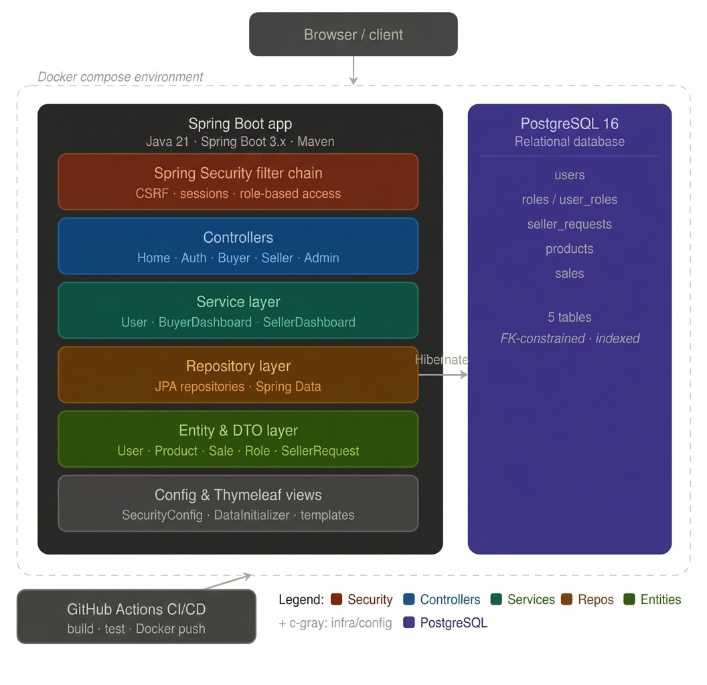
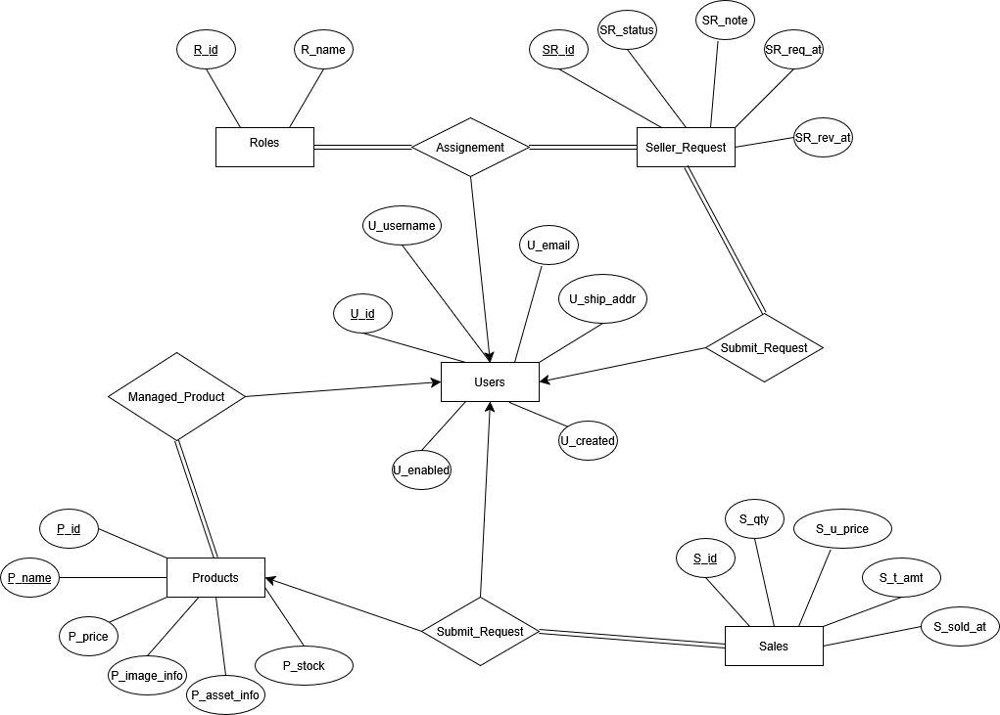

# Mini Marketplace

A Spring Boot based digital marketplace where users can register, browse products, purchase digital assets, and manage role based workflows (Buyer, Seller, Admin).

## Project Description

Mini Marketplace is a server rendered web application built with Spring Boot, Thymeleaf, Spring Security, and PostgreSQL.

Main capabilities:
- Authentication and registration with role based access control
- Buyer dashboard with catalog browsing, cart, wishlist, orders, and downloads
- Seller dashboard for product management, uploads, and sales analytics
- Admin dashboard to review seller requests and manage platform users
- Dockerized local and production style runtime

## Tech Stack

- Java 21
- Spring Boot 3.4.1
- Spring MVC + Thymeleaf
- Spring Security
- Spring Data JPA (Hibernate)
- PostgreSQL (runtime)
- H2 (test profile)
- Maven
- Docker + Docker Compose
- GitHub Actions (CI/CD)

## Architecture Diagram



## ER Diagram




## API Endpoints

Note: this project is primarily MVC (HTML views + form posts), not a pure JSON REST API.

### Public and Auth Routes

| Method | Path | Access | Purpose |
|---|---|---|---|
| GET | `/` | Public | Guest homepage (logged-in users are redirected by role) |
| GET | `/search?q=...` | Public | Guest search page (logged-in users redirect to buyer dashboard search) |
| GET | `/auth/login` | Public | Login page |
| GET | `/auth/login/` | Public | Login page (trailing slash) |
| POST | `/auth/login` | Public | Login submit handled by Spring Security |
| GET | `/auth/register` | Public | Registration page |
| GET | `/auth/register/` | Public | Registration page (trailing slash) |
| POST | `/auth/register` | Public | Create buyer account |
| POST | `/auth/logout` | Authenticated | Logout handled by Spring Security |
| GET | `/access-denied` | Public | Custom error/forbidden page |

### Buyer Routes (`/buyer`)

| Method | Path | Access | Purpose |
|---|---|---|---|
| GET | `/buyer`, `/buyer/`, `/buyer/dashboard` | Buyer | Buyer dashboard/catalog |
| GET | `/buyer/cart` | Buyer | Cart + wishlist view |
| POST | `/buyer/cart/add` | Buyer | Add item to cart |
| POST | `/buyer/cart/update` | Buyer | Update cart quantity |
| POST | `/buyer/cart/remove` | Buyer | Remove item from cart |
| POST | `/buyer/cart/checkout` | Buyer | Checkout all cart items |
| POST | `/buyer/wishlist/add` | Buyer | Add item to wishlist |
| POST | `/buyer/wishlist/remove` | Buyer | Remove item from wishlist |
| POST | `/buyer/purchase` | Buyer | Direct purchase single product |
| GET | `/buyer/orders` | Buyer | Order history/library |
| GET | `/buyer/orders/{id}/download` | Buyer | Download purchased digital asset |
| GET | `/buyer/account` | Buyer | Account page |
| POST | `/buyer/account/address` | Buyer | Update shipping address |
| GET | `/buyer/seller-request` | Buyer | Seller request form |
| POST | `/buyer/seller-request` | Buyer | Submit seller request |
| GET | `/buyer/products/{id}/image` | Buyer | Stream product image |

### Seller Routes (`/seller`)

| Method | Path | Access | Purpose |
|---|---|---|---|
| GET | `/seller/dashboard` | Seller | Seller dashboard |
| POST | `/seller/products` | Seller | Create product |
| POST | `/seller/products/{id}/update` | Seller | Update product |
| POST | `/seller/products/{id}/delete` | Seller | Delete product |
| POST | `/seller/sales` | Seller | Record sale event |
| GET | `/seller/products/{id}/image` | Seller | Stream product image |
| GET | `/seller/products/{id}/asset` | Seller | Download product asset |

### Admin Routes (`/admin`)

| Method | Path | Access | Purpose |
|---|---|---|---|
| GET | `/admin/dashboard` | Admin | Admin dashboard |
| POST | `/admin/seller-requests/{id}/approve` | Admin | Approve seller request |
| POST | `/admin/seller-requests/{id}/reject` | Admin | Reject seller request |

## Run Instructions

### Prerequisites

- Java 21
- Maven 3.9+
- Docker Desktop (for Docker based runs)

### 1) Configure Environment

Create `.env` from template:

```powershell
Copy-Item .env.example .env
```

Update values in `.env` as needed.

### 2) Run with Docker Compose (recommended)

```powershell
docker compose up --build
```

Services:
- App: `http://localhost:${APP_PORT}` (default `8080`)
- PostgreSQL: `localhost:${DB_PORT}` (default from `.env`)

Stop:

```powershell
docker compose down
```

### 3) Run App Locally with Local Java (DB in Docker)

Start database only:

```powershell
docker compose -f compose.dev.yaml up -d
```

Run Spring Boot app:

```powershell
.\mvnw.cmd spring-boot:run
```

Stop DB:

```powershell
docker compose -f compose.dev.yaml down
```

### 4) Run Tests

```powershell
.\mvnw.cmd test
```

Test profile uses `src/test/resources/application-test.yaml` with H2 in memory database, so PostgreSQL container is not required for most tests.

## CI/CD Explanation

Workflow file: `.github/workflows/ci-cd.yml`

Pipeline stages:

1. `ci` (runs on every push, pull request, and manual dispatch)
- Checks out code
- Sets up Java 21 (Temurin)
- Runs tests: `./mvnw -B test`
- Packages app: `./mvnw -B -DskipTests package`
- Uploads built JAR artifact
- Verifies Docker build

2. `publish-image` (push to `main` or `master` only)
- Depends on `ci`
- Logs in to GitHub Container Registry (`ghcr.io`)
- Builds and pushes image tags (branch, SHA, latest on default branch)

3. `deploy` (push to `main` or `master` only)
- Depends on `publish-image`
- Triggers Render deploy hook by calling `RENDER_DEPLOY_HOOK_URL` from GitHub Secrets
- If `RENDER_DEPLOY_HOOK_URL` is not set, deployment is skipped without failing the workflow
- Live application URL: `https://mini-marketplace-eclu.onrender.com`

Set this secret at:
- `Repository Settings -> Secrets and variables -> Actions -> New repository secret`
- Name: `RENDER_DEPLOY_HOOK_URL`
- Value: your Render deploy hook URL

Notes:
- Concurrency is enabled, so older in-progress runs on the same branch are canceled.
- `RENDER_DEPLOY_HOOK_URL` is optional.

## Project Structure Snapshot

```text
src/
├── main/
│   ├── java/
│   │   └── com/example/minimarketplace/
│   │       ├── config/
│   │       ├── controller/
│   │       ├── dto/
│   │       ├── entity/
│   │       ├── exception/
│   │       ├── repository/
│   │       └── service/
│   └── resources/
│       ├── templates/
│       ├── static/
│       └── application.yaml
└── test/
    ├── java/
    └── resources/
        └── application-test.yaml
```
